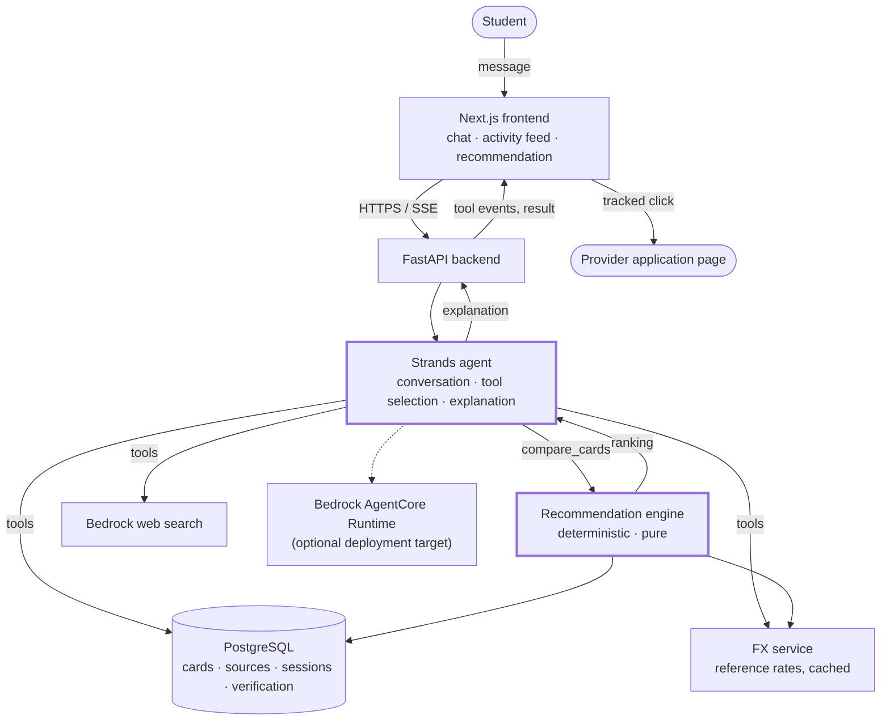
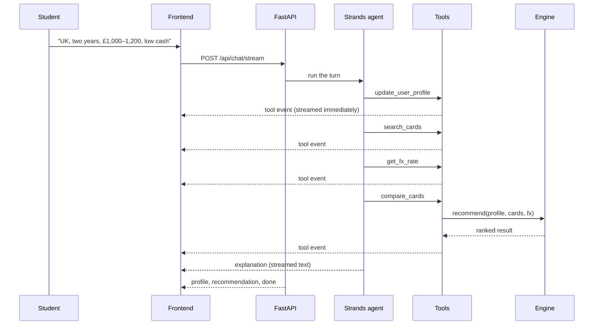
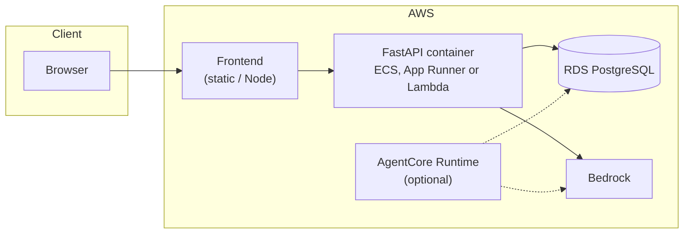

# Architecture

## The shape of the system



The two thick boxes are the ones that matter, and the split between them is the
whole design: the **agent** decides what to do and how to explain it, the
**engine** decides what things cost and which card wins.

## The pipeline

```
Natural language
      ↓  Strands agent
Structured UserProfile
      ↓  search_cards / get_card_details / research_card
Verified card data (with sources)
      ↓  get_fx_rate
Reference rates
      ↓  calculate_card_cost      ← deterministic
Expected cost per card
      ↓  compare_cards            ← deterministic
Ranked result + confidence
      ↓  Strands agent
Explanation
      ↓
Recommendation UI → Apply
```

What never happens:

```
User message → LLM → "I think HDFC is best"
```

## Why the engine is a pure function

`recommend(profile, cards, fx) -> RecommendationResult` performs no I/O, holds
no state and calls no model. That buys three things:

- **Testability.** Ranking rules are asserted against hand-built fixtures, with
  no database or network in the way.
- **Reproducibility.** The same inputs always produce the same ranking, so a
  result can be explained after the fact.
- **A hard boundary.** The model is handed the ranking as a fact to explain. It
  has no route to change it, because the function that produced it does not
  take a model.

The service layer (`app/recommendation/service.py`) is the only place that
translates database rows into the engine's frozen `CardFacts` snapshots.

## Data flow for one turn



Each tool event is written to `tool_events` as it happens and streamed in the
same moment. The activity feed is a view of that table — there is no code path
that emits an event the agent did not cause.

## Handling missing data

The catalogue distinguishes three states that are easy to conflate and
expensive to get wrong:

| State | Meaning | How it is priced |
| --- | --- | --- |
| `is_waived` | The provider states the charge is nil | ₹0, and shown as free |
| `is_unknown` | The provider publishes no figure | Imputed at the worst figure among the compared cards, flagged |
| `amount IS NULL` | Not verified | Same as unknown |

Costing runs over the whole candidate set rather than card by card, precisely so
that a missing component can be filled from what competitors charge. Where no
card in the set publishes a charge, it is dropped and the total is labelled a
lower bound.

The rule this enforces: **a card can never rank better because its issuer
published less.**

## Verification

```
Stale card  →  research official sources  →  extract  →  compare with DB
                                                             ↓
                                                    verification_changes
                                                       (status: pending)
                                                             ↓
                                                     admin approval
                                                             ↓
                                                     published data
```

The first version never writes to the catalogue automatically. A misread fee
that reaches a student is worse than a stale one, so a human sits in the loop.

## Deployment



The backend stays a conventional FastAPI application whether or not AgentCore is
used; `agentcore/entrypoint.py` is a thin adapter over the same `run_agent`
callable, so neither deployment target is privileged.
